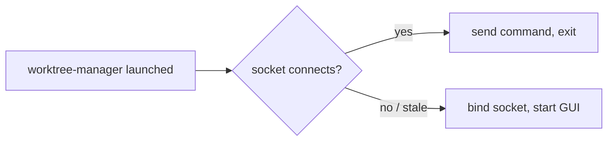
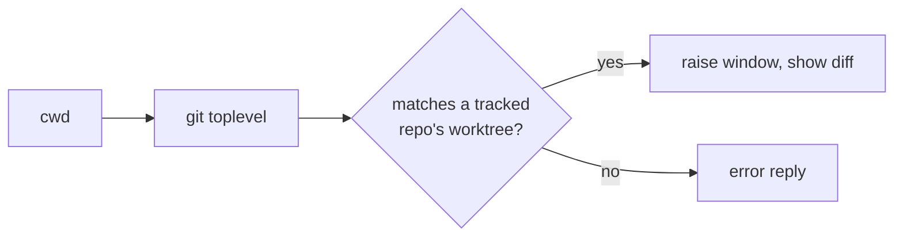

<!-- autobot-status
stage: 7
iteration: 1
gate: confirmed
updated: 2026-07-02
-->

# Single-Instance CLI Control

## Overview

Make `worktree-manager` a single-instance app: launching it while an instance is already running focuses the existing window instead of opening a second one. Add a `worktree-manager diff` terminal command that connects to the running instance over a local socket and tells it to open the Diff panel for the worktree at the caller's `$PWD`, raising the window in the process.

This feature has no new UI screens of its own — it controls the existing app from the terminal — so Stage 1a (Frontend Design) is skipped per convention.

## Decisions locked in

- **IPC transport:** Unix domain socket at `~/.config/worktree-manager/worktree-manager.sock`. The GUI process listens; CLI invocations connect, send one JSON request, read one JSON reply, exit.
- **Worktree resolution:** `cwd` → `git rev-parse --show-toplevel` → match against the app's tracked worktrees. No implicit fallback to "whatever the GUI has open."
- **Focus behavior:** every command that targets a view raises and activates the window.
- **Command scope (this run):** single-instance launch behavior + `worktree-manager diff [--from REF] [--to REF]`. Additional commands (`worktrees`, `branches`, `new`, `switch`, `run`, `cleanup`, `list`, `status`) are deferred — the socket/dispatch plumbing built here is designed to add them cheaply later, but they are out of scope now.

## Reuse survey

- [`worktree_manager/cli.py`](worktree-manager/worktree_manager/cli.py) `main()` (L1055), `parse_args()` (L48) — extend to add subcommands and the single-instance check before `QApplication` is constructed.
- [`worktree_manager/config_store.py`](worktree-manager/worktree_manager/config_store.py) `ConfigStore` — existing pattern for a per-user file under `~/.config/worktree-manager/`; the socket path and any lock file follow this same directory convention rather than inventing a new location.
- [`worktree_manager/spotlight/action_registry.py`](worktree-manager/worktree_manager/spotlight/action_registry.py) `ActionRegistry` / `ActionSpec` — existing named-action dispatch used by the Spotlight overlay. The CLI's command dispatch is a new, much simpler mechanism (socket JSON → method call) since it's process-to-process rather than in-process string parsing; not a fit to reuse directly, but keeps the same "registry of named handlers" shape for consistency.
- [`App._diff_from_working_tree`](worktree-manager/worktree_manager/cli.py#L825) and [`App._show_diff`](worktree-manager/worktree_manager/cli.py#L813) — the existing methods the `diff` command's socket handler calls into directly. No new diff-rendering logic needed.
- [`DiffPanel.show_diff`](worktree-manager/worktree_manager/ui/diff_panel.py#L213) / [`DiffPanel._load_worktree`](worktree-manager/worktree_manager/ui/diff_panel.py#L162) and [`GitService.infer_branch_suggestions`](worktree-manager/worktree_manager/git_service.py#L426) — reused as-is so the CLI's default `from_ref` (no `--from` given) preselects the inferred **parent branch**, exactly matching the right-click "Diff from working tree" menu action. No new parent-branch resolution logic is written for the CLI.
- [`GitService.is_valid_repo`](worktree-manager/worktree_manager/git_service.py#L42) — reused for resolving/validating the cwd's repo.
- [`GitService.list_worktrees`](worktree-manager/worktree_manager/git_service.py#L82) returning [`WorktreeModel`](worktree-manager/worktree_manager/models.py#L5) (`path`, `branch`, ...) — reused to match cwd's toplevel against a tracked repo's worktrees.
- [`ConfigStore.all_repos`](worktree-manager/worktree_manager/config_store.py#L247) / [`ConfigStore.get_repo`](worktree-manager/worktree_manager/config_store.py#L22) — reused to find which tracked repo (if any) owns the resolved worktree.

---

## Backend Design

### Single-instance detection

The lock is the socket itself — no separate PID file. On startup, `main()` tries to connect to the Unix socket at `~/.config/worktree-manager/worktree-manager.sock` (same directory convention as [`ConfigStore`](worktree-manager/worktree_manager/config_store.py)) before doing anything else (before `QApplication` is constructed):

```
main():
    sock_path = socket_path()  # ~/.config/worktree-manager/worktree-manager.sock
    if args.command is not None:
        # CLI-command invocation (e.g. `worktree-manager diff`)
        reply = try_send_command(sock_path, command_payload(args))
        if reply is not None:
            print/exit based on reply
            return
        else:
            print "No running instance." to stderr, exit 1
            return

    # bare launch (`worktree-manager` or `worktree-manager <repo_path>`)
    if instance_is_running(sock_path):
        send_command(sock_path, {"action": "focus", "repo_path": args.repo_path})
        return   # do not construct QApplication — exit immediately
    else:
        start_ipc_server(sock_path)   # binds + listens in a background QThread
        run the existing GUI startup (QApplication, App, exec)
```

`instance_is_running` is a quick connect-attempt-and-close, not a persistent connection:

```
instance_is_running(sock_path) -> bool:
    if not sock_path exists: return False
    try: connect, close immediately, return True
    except ConnectionRefusedError:
        # stale socket file from a crashed process — remove it
        unlink(sock_path)
        return False
```



### IPC server (runs inside the GUI process)

A small `IpcServer` owns the listening socket, runs its accept-loop on a background thread, and marshals each request onto the Qt main thread via a Signal (Qt widgets are not thread-safe to touch directly from a worker thread — the existing codebase already uses this bridge pattern, e.g. [`_FinishedBridge`](worktree-manager/worktree_manager/cli.py#L43)).

```
class IpcServer(QObject):
    command_received: Signal(dict, socket)   # (request, client_conn) — handler replies on conn

    start(sock_path):
        remove sock_path if exists
        bind + listen on sock_path
        spawn daemon thread running _accept_loop

    _accept_loop():
        while True:
            conn = socket.accept()
            request = read one JSON line from conn
            self.command_received.emit(request, conn)  # queued connection -> main thread
```

The `App` (or a small new `IpcCommandHandler` owned by it) connects to `command_received` and does the actual work on the Qt main thread — reading/writing widgets safely — then writes one JSON reply line back on `conn` and closes it.

### Command payload shape

Every request/reply is a single JSON object terminated by `\n`.

```
# bare launch, instance already running
{"action": "focus"}
-> {"ok": true}

# `worktree-manager diff [--from REF] [--to REF]` run from $PWD
{"action": "diff", "cwd": "<absolute path caller ran from>", "from_ref": "<or null>", "to_ref": "<or null>"}
-> {"ok": true}
-> {"ok": false, "error": "cwd is not part of any tracked repo"}
```

### `diff` command resolution + dispatch

```
handle_diff(app: App, cwd, from_ref, to_ref):
    toplevel = git_service.toplevel_for(cwd)      # `git rev-parse --show-toplevel`, cwd=cwd
    if toplevel is None:
        return error "not inside a git repository"

    repo_path = find_tracked_repo(app._store, toplevel)
    if repo_path is None:
        return error "cwd is not part of any tracked repo"

    worktrees = app._git.list_worktrees(repo_path)
    worktree = next((w for w in worktrees if w.path == toplevel), None)
    if worktree is None:
        return error "cwd's worktree is not tracked"

    app.raise_and_activate()          # new: show(), raise_(), activateWindow()
    app._show_diff()
    panel = app._panel_cache["diff"]
    if from_ref or to_ref:
        panel.show_diff(repo_path, worktree_path=worktree.path, from_ref=from_ref, to_ref=to_ref)
    else:
        app._diff_from_working_tree(worktree.path)   # to_ref="working_tree_unstaged", from_ref=None
    return ok
```

`find_tracked_repo` walks `app._store.all_repos()` and returns the repo whose path equals `toplevel` (a worktree's toplevel is always one of `git worktree list`'s own paths for its repo, so matching `toplevel` against tracked repo paths directly does not work for *linked* worktrees — see note below).

**`--from`/`--to` default resolution matches the right-click "Diff from working tree" menu action exactly — no new logic needed.** Both code paths above ultimately call [`DiffPanel.show_diff`](worktree-manager/worktree_manager/ui/diff_panel.py#L213), which always calls [`_load_worktree`](worktree-manager/worktree_manager/ui/diff_panel.py#L162) first. `_load_worktree` sets the default `from_ref` (the "older" ref) using this precedence, before any caller-supplied override is applied:

1. A saved [`ConfigStore`](worktree-manager/worktree_manager/config_store.py) diff preference for the repo (`get_diff_pref`), if it's a valid non-SHA, single-token ref.
2. Otherwise, the inferred **parent branch** from [`GitService.infer_branch_suggestions(repo_path, current_branch)`](worktree-manager/worktree_manager/git_service.py#L426) — walks `git log --first-parent --simplify-by-decoration`, skipping the current branch and anything already merged into HEAD, to find the nearest ancestor branch. Falls back to `"main"` (or `None` if already on `main`).

`panel.show_diff(..., from_ref=None)` — the no-flags case via `_diff_from_working_tree` — leaves this default untouched, so the parent branch is preselected exactly as in the right-click menu. When the CLI caller passes `--from`, it overrides step 1/2's result **after** `_load_worktree` has already run (`show_diff` only overwrites the combo selection for refs it was explicitly given, per [`show_diff`'s existing override comment](worktree-manager/worktree_manager/ui/diff_panel.py#L220-225)) — so passing only `--to` still gets the inferred parent branch as `from_ref`, matching the menu's behavior. No new resolution code is needed for this; it is inherited for free by calling the existing `DiffPanel` methods.

**Constraint:** `git rev-parse --show-toplevel` run inside a linked worktree returns that worktree's own path, not the main repo's path. So resolution must check the toplevel against every tracked repo's `list_worktrees()` result (not just against `all_repos()` keys) to find a match — a linked worktree's toplevel equals some `WorktreeModel.path`, not the repo's registered path. The pseudocode above reflects this: `repo_path` is found first via a helper that checks each tracked repo's worktree list for a `path == toplevel` match, then `list_worktrees(repo_path)` is re-queried to get the matching `WorktreeModel`.



### Client side (CLI invocation)

```
try_send_command(sock_path, payload) -> reply | None:
    try:
        connect to sock_path
    except (FileNotFoundError, ConnectionRefusedError):
        return None   # no running instance
    write JSON payload + "\n"
    reply = read one JSON line
    close
    return reply
```

If `try_send_command` returns `None` for a command invocation (not a bare launch), `main()` prints `"No running instance. Launch worktree-manager first."` to stderr and exits 1 — it does **not** auto-launch a new instance, since the command (`diff`) has nothing to target until a repo is loaded.

### Argument parsing

Extend [`parse_args()`](worktree-manager/worktree_manager/cli.py#L48) with a subcommand:

```
parser.add_argument("repo_path", nargs="?", default=None)   # existing, bare-launch path
subparsers = parser.add_subparsers(dest="command")
diff_parser = subparsers.add_parser("diff")
diff_parser.add_argument("--from", dest="from_ref", default=None)
diff_parser.add_argument("--to", dest="to_ref", default=None)
```

`worktree-manager <path>` (bare launch with a repo path) and `worktree-manager diff` (subcommand) are mutually exclusive at the argparse level — `repo_path` and `command` are structurally distinct as long as `diff` never collides with a real path a user would pass (extremely unlikely, and matches how `git` itself disambiguates subcommands from paths).

---

## Iteration Plan

- Iteration 0 — Single-instance launch + `worktree-manager diff`
- Iteration 1 — `worktree-manager diff --from REF --to REF`

### Iteration 0 — Single-instance launch + `worktree-manager diff`
**Context file:** [Iteration 0 context](autobot-single-instance-cli-ctx-iter-0-single-instance-launch-plus-diff-2026-07-02.md)

## ✋ Manual Testing Gate — Iteration 0

> STOP. Do not proceed to Iteration 1 until every item is confirmed.

- [x] Launch `worktree-manager` once; it opens normally.
- [x] Launch `worktree-manager` a second time (same or different repo path) while the first is running; observe the existing window raises/activates and no second window appears.
- [x] From a terminal, `cd` into a tracked worktree's directory and run `worktree-manager diff`; observe the running instance raises, switches to the Diff panel, and preselects the inferred parent branch as the "from" ref with working tree as "to".
- [x] Run `worktree-manager diff` from a directory that is not part of any tracked repo; observe a clear error on stderr and a non-zero exit code, with no crash and no window change.
- [x] Run `worktree-manager diff` when no instance is running; observe "No running instance. Launch worktree-manager first." on stderr and exit code 1, and no new window opens.

**Confirmed by user:** 2026-07-02
**How to confirm:** Check every box, then reply "Iteration 0 confirmed" or describe what failed.

### Iteration 1 — `worktree-manager diff --from REF --to REF`
**Context file:** [Iteration 1 context](autobot-single-instance-cli-ctx-iter-1-diff-with-explicit-refs-2026-07-02.md)
**Reviewed plan:** [Iteration 1 plan](autobot-single-instance-cli-plan-iter-1-diff-with-explicit-refs-2026-07-02.md)

## ✋ Manual Testing Gate — Iteration 1

> STOP. Do not proceed further until every item is confirmed.

- [x] `worktree-manager diff --from main` opens the diff panel with `main` as the "from" ref and the default "to" (working tree).
- [x] `worktree-manager diff --to HEAD~3` opens the diff panel with the default inferred parent branch as "from" and `HEAD~3` as "to".
- [x] `worktree-manager diff --from main --to HEAD~3` opens the diff panel with exactly those two refs, no inferred defaults used.
- [x] An unresolvable `--from`/`--to` ref produces a clear error rather than a crash or silent blank diff.
- [x] Regression: `worktree-manager diff` (no flags) still preselects the inferred parent branch as before.
- [x] Regression: single-instance focus behavior from Iteration 0 still works.

**Confirmed by user:** 2026-07-02
**How to confirm:** Check every box, then reply "Iteration 1 confirmed" or describe what failed.

### Implementation Ledger — Iteration 1
- Phase 1.1 — `--from` alone forwards to show_diff with default "to"
  - `test_diff_with_from_ref_only_forwards_from_and_leaves_to_default`: red → green ✓ (already satisfied by Iteration 0)
- Phase 1.2 — `--to` alone forwards to show_diff with default "from"
  - `test_diff_with_to_ref_only_forwards_to_and_leaves_from_default`: red → green ✓ (already satisfied by Iteration 0)
- Phase 1.3 — both `--from` and `--to` forward exactly, no defaults
  - `test_diff_with_both_refs_forwards_both_exactly`: red → green ✓ (already satisfied by Iteration 0)
- Phase 1.4 — `show_diff` overrides only the explicitly-provided ref
  - `test_show_diff_selects_only_newer_when_only_to_given`: red → green ✓
  - `test_show_diff_selects_only_older_when_only_from_given`: red → green ✓
  - `test_show_diff_selects_both_lists_when_both_given`: red → green ✓
- Phase 1.5 — an unresolvable `--from`/`--to` ref surfaces as an error reply
  - `test_ref_exists_returns_true_for_resolvable_ref`: red → green ✓
  - `test_ref_exists_returns_false_for_unresolvable_ref`: red → green ✓
  - `test_diff_with_unresolvable_ref_returns_error_reply`: red → green ✓ (new: `GitService.ref_exists` + validation guard in `_handle_diff_command`)
- Phase 1.6 — regression: no flags still preselects the inferred parent branch
  - `test_diff_with_no_flags_still_uses_working_tree_default`: red → green ✓

**Regression suites re-run:** `tests/test_cli_single_instance_qt.py` (12 tests), `tests/test_diff_panel_qt.py` — all pass.
**Final targeted run:** `tests/test_cli_diff_command_qt.py` + `tests/test_diff_panel_show_diff_refs_qt.py` + `tests/test_git_service_ref_exists.py` → 17/17 passed.
